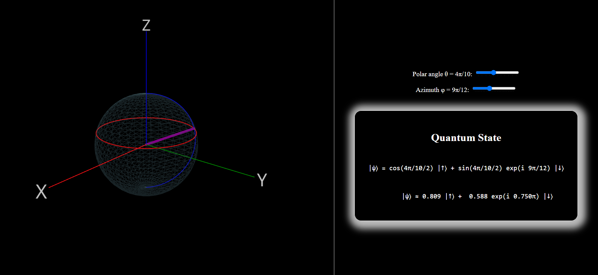

# Bloch Sphere Simulator

## Introduction
The Bloch Sphere Simulator is an interactive 3D visualizer designed to help students and enthusiasts understand the state of a qubit in quantum computing. The tool aims to provide a practical, visual way to grasp quantum mechanics concepts through an intuitive graphical interface.

## Features
- **3D Visualization**: View the state of a qubit on a Bloch sphere in three dimensions.
- **Interactive Controls**: Manipulate the qubit state using simple controls to see how it affects the Bloch sphere.
- **Educational Tool**: Ideal for students and educators in quantum mechanics or anyone interested in the basics of quantum computing.

## Feedback and Contributions
I welcome any comments, feedback, or requests for further changes to improve the simulator. Don't hesitate to reach out to me at [c.tok@campus.lmu.de](mailto:c.tok@campus.lmu.de) with your suggestions or inquiries.

## License
This project is open-sourced under the MIT license. See the LICENSE file for more details.

---

Thank you for exploring the Bloch Sphere Simulator. I hope it serves as a valuable tool in your studies or teaching of quantum computing.
